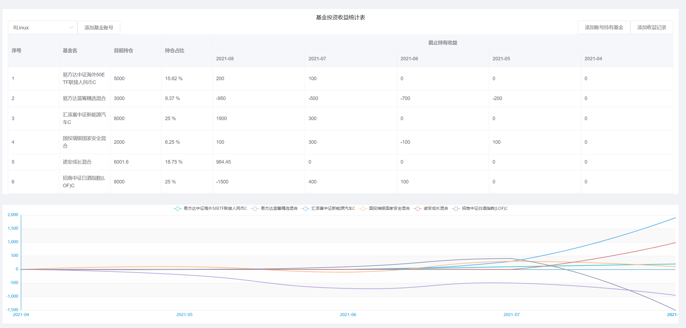
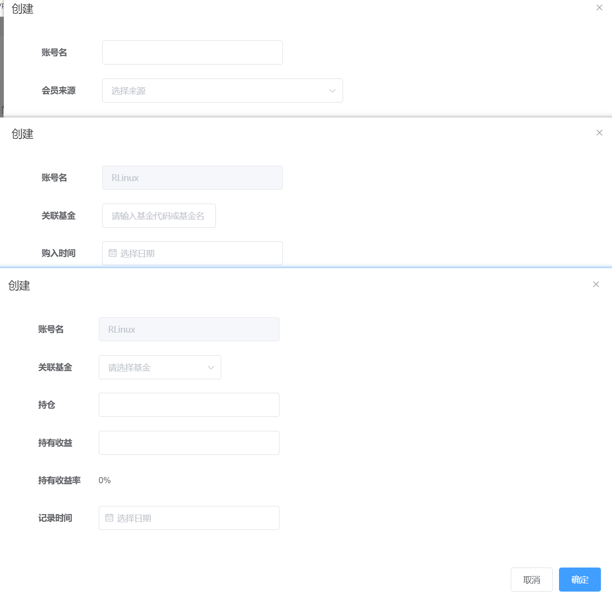
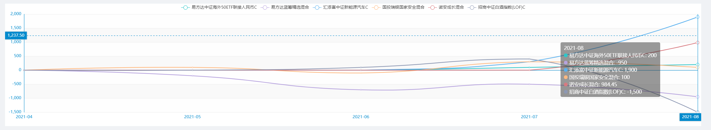

## 介绍
一个简单记录与展示基金收益情况web，支持多账号记录，前后端分离

## 来源
本人平时也有买基金，有看到大V的写的文章，什么几成仓啊，策略什么的。也看过他们截图的，有看到是exeExcel做的，也找了一下相关的资料，几乎所有的模板都是要收费的。当然自己去学一下表格的公式也能实现到类似的效果。既然如此，为何不用代码来实现，说干就干。

## 说明
1、后端：srpingboot + mybatis-plus、前端：vue + elementUI + echart

2、操作流程：创建基金账号 -> 创建账号关联基金 -> 创建账号基金日收益记录

3、添加日收益，会同步检查是否要更新持仓数据等

4、名词说明
- 目前持仓：从`账号持有基金-fund_account_hold`数据获取
- 持仓占比：`目前持仓 / 账号总持仓`
- 截止持有收益： 每月日记录`记录时间`最新一条记录

5、图片展示数据均为虚构

## 功能点
- [x] 基金多账号记录
- [x] 日收益记录、更新月收益
- [x] 月收益展示、持仓占比
- [x] 月收益趋势图
- [ ] 还没想清楚...

## 部署运行
简单的springboot项目和vue项目运行方式

## 界面展示
主显示图

数据提交图

收益放大图
